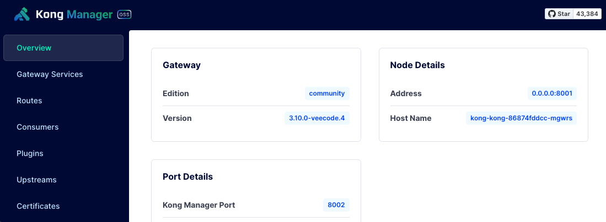

# VeeCode APIP



> Part of the **[VeeCode Platform](https://platform.vee.codes/)** — a self-service Internal Developer Platform based on Backstage.

**APIP** is an open, hardened distribution of [Kong Gateway](https://github.com/Kong/kong) (OSS), maintained by Vertigo as the runtime layer of the VeeCode Platform.

We pick up where Kong OSS slowed down: tagged releases, multi-arch RHEL builds, an SBOM-driven security gate, and a plugins-first extension model that survives upstream syncs.

## The VeeCode Platform

APIP is the gateway. It pairs with **VeeCode DevPortal** — a [Backstage](https://backstage.io/)-based Internal Developer Portal — so the full API lifecycle becomes a self-service experience:

```pre
   design → publish → secure → run → observe → retire
   └── DevPortal ──┘   └──────── APIP ────────┘
```

- **VeeCode DevPortal** — where API producers design, version, document, publish, and govern APIs; where consumers discover and subscribe to them.
- **VeeCode APIP** (this org) — the production Kong-based gateway that enforces auth, rate limits, routing, and observability for those APIs.

Together they take an API from spec to retirement without anyone filing a ticket.


## Kong OSS vs. Kong APIP

|                          | Kong OSS (today)                                                        | Kong APIP                                                                      |
| ------------------------ | ----------------------------------------------------------------------- | ------------------------------------------------------------------------------ |
| **Release cadence**      | No tagged releases since `3.9.1` — `master` only                       | Tagged `3.10.0-veecode.N`, each with a written release plan                    |
| **Container image**      | Rolling, no signed pinned tag for OSS                                   | Signed multi-arch tags on Docker Hub ([`veecode/kong`](https://hub.docker.com/r/veecode/kong))     |
| **Architectures**        | amd64-first                                                             | amd64 + arm64, both first-class                                                |
| **Target OS**            | Debian-based                                                            | UBI / RHEL 10 (RHEL · Rocky · AlmaLinux · CentOS Stream)                       |
| **RPM packages**         | No current OSS RPMs                                                     | Signed RPMs for the RHEL family                                                |
| **Security gate**        | Container scan only — misses statically-linked OpenSSL / OpenResty / nginx / LuaJIT | CycloneDX SBOM at release time, scanned with Grype — catches the static deps |
| **Extension model**      | Patch the fork — conflicts on every upstream sync                       | Plugins-first — custom features live on paths upstream never touches           |
| **Release documentation** | Upstream docs only                                                     | Per-release roadmap, ADRs, upstream-sync playbook                              |

## What we ship

- A fork of **Kong Gateway** with VeeCode-specific patches and plugins
- Multi-arch (amd64 + arm64) **container images** based on RHEL 10, published as [`veecode/kong`](https://hub.docker.com/r/veecode/kong)
- Signed **RPMs** for RHEL-family distros (RHEL / Rocky / AlmaLinux / CentOS Stream)

Releases follow the `3.10.0-veecode.N` scheme — pinned to the last upstream Kong OSS tag, with the `-veecode.N` suffix tracking our own iterations.

## Repositories

- **apip-parent** — coordination repo: release plans, ADRs, SBOMs, shared definitions
- **kong** — fork of Kong Gateway with VeeCode patches and the RPM release pipeline
- **docker-kong** — Dockerfiles and the multi-arch image build for `veecode/kong`
- **kong-builder** — local-only build toolchain image for reproducing CI builds on a workstation

## Learn more

- VeeCode Platform — <https://platform.vee.codes/>
- License — Apache 2.0 across all repos; see each repo's `LICENSE` and `NOTICE`
